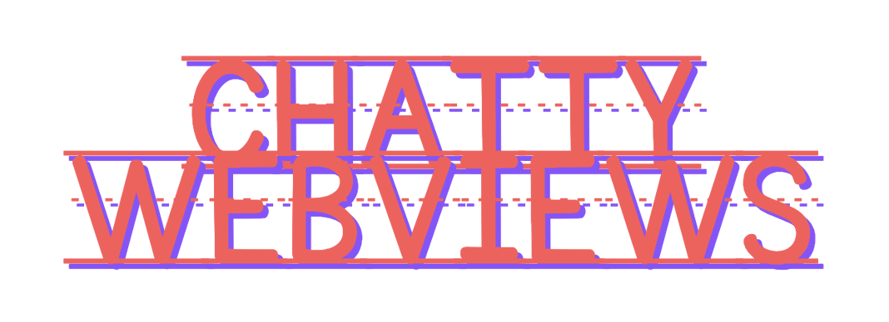
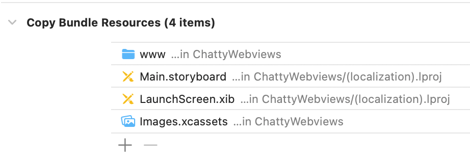

[](https://travis-ci.org/tdermendjiev/ChattyWebviews)
[](https://cocoapods.org/pods/ChattyWebviews)
[](https://cocoapods.org/pods/ChattyWebviews)
[](https://cocoapods.org/pods/ChattyWebviews)


Chatty Webviews adds easy and simple communication mechanism between your native classes and webviews.

## Features

 * [x] Serve local and remote packages
 * [x] Specify path for the local web app package
 * [x] Exchange messages between native classes and webviews
 * [ ] Update packages remotely (in progress)

## Example

To run the example project, clone the repo, and run `pod install` from the Example directory first.

## Requirements

- iOS 11.0+ 
- Swift 5.0+
- [chatty-webviews-js]() (for sending/handling messages from your web components)

## Installation

ChattyWebviews is available through [CocoaPods](https://cocoapods.org). To install
it, simply add the following line to your Podfile:

```ruby
pod 'ChattyWebviews'
```

## Usage 

### Step 1
Add your web project build foder - e.g. **dist** or **www** (if you are using Ionic) - to the Xcode project and verify it's in the **Copy Bundle Resources** build phase:



### Step 2
Initialize webview viewcontrollers:

```swift
import ChattyWebviews

class MainTabBarViewController: UITabBarController {
    
    override func viewDidLoad() {
        super.viewDidLoad()
        
        let scheduleVC = WebViewFactory.createWebview(localFolder: "www", path: "/schedule")
        scheduleVC.tabBarItem = UITabBarItem(title: "Schedule", image: nil, tag: 0)
        scheduleVC.messageDelegate = self
        
        let speakersVC = WebViewFactory.createWebview(localFolder: "www", path: "/speakers")
        speakersVC.tabBarItem = UITabBarItem(title: "Speakers", image: nil, tag: 1)
        speakersVC.messageDelegate = self
        
        let nativeVC = UIStoryboard(name: "Main", bundle: nil).instantiateViewController(withIdentifier: "button-sample")
        nativeVC.tabBarItem = UITabBarItem(title: "Native", image: nil, tag: 2)
        
        self.viewControllers = [scheduleVC, speakersVC, nativeVC]
        
    }
}
```

### Step 3
To receive messages from the webviews you need to conform to the CWMessageDelegate protocol. The code below prints a message sent from the webviews and then responds with another one.

```swift
extension MainTabBarViewController: CWMessageDelegate {
    
    func controller(_ controller: ChattyWebviews.CWViewController, didReceive message: ChattyWebviews.CWMessage) {
        print(message.topic)
        let msg = CWMessage(topic:"mife-a", body: ["msg":"done"])
        controller.sendMessage(msg)
    }

}
```

## Author

Teodor Dermendjiev, tdermendjievft@gmail.com

## Supporters

[Azbouki Software](https://www.azbouki.com/)


## License

ChattyWebviews is available under the MIT license. See the LICENSE file for more info.
